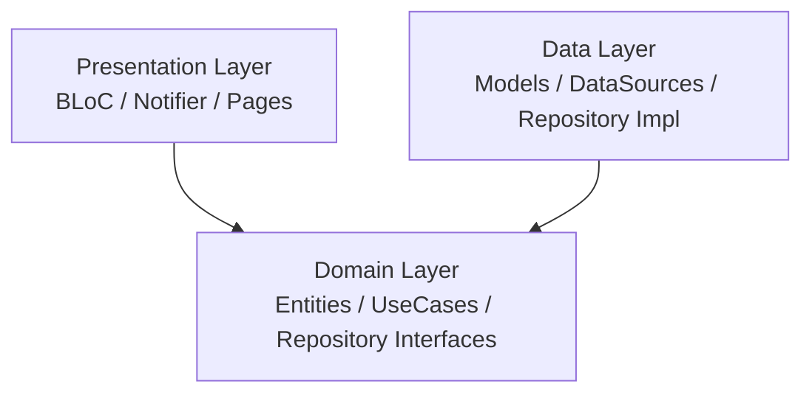

# Flutter News App

A production-ready Flutter news application built on **Clean Architecture + MVVM**. Fetches articles from [NewsAPI](https://newsapi.org/) with offline support, bookmarking, and debounced search — developed within a 3-day deadline.


---

## Table of Contents

- [Demo](#demo)
- [API Documentation](#api-documentation)
- [Setup Instructions](#setup-instructions)
- [Architecture & State Management](#architecture--state-management)
- [Planning Process & Task Breakdown](#planning-process--task-breakdown)
- [Git Workflow & Strategy](#git-workflow--strategy)
- [Security & Offline Data](#security--offline-data)
- [Testing](#testing)
- [AI Transparency](#ai-transparency)
- [Documentation Index](#documentation-index)

---

## Demo

### Screen Recording

<video src="screenshots/demo.mp4" controls width="300"></video>

---

## API Documentation

This project uses [NewsAPI](https://newsapi.org/) as the data source.

- Official API reference: [NewsAPI Docs](https://newsapi.org/docs)
- Local endpoint documentation: [`docs/newsapi-everything-docs.md`](docs/newsapi-everything-docs.md)

---

## Setup Instructions

### Prerequisites

- Flutter SDK (stable channel)
- Android SDK (min API 21) or Xcode (iOS 13+)
- A free API key from [newsapi.org](https://newsapi.org/)

### Install & Run

```bash
# 1. Clone the repository
git clone https://github.com/coder7eeN/news-app.git
cd news-app

# 2. Install dependencies
flutter pub get

# 3. Generate Hive adapters
dart run build_runner build --delete-conflicting-outputs

# 4. Run the app (replace with your API key)
flutter run --dart-define=NEWS_API_KEY=your_key_here
```

### Verify

```bash
# Run tests
flutter test test/features/ --coverage

# Run lint
flutter analyze --fatal-infos
```

---

## Architecture & State Management

### Clean Architecture

The project follows the **dependency rule** — inner layers never import outer layers:



### Layer Contracts

| Layer | Artifact | Rules |
|---|---|---|
| **Domain** | Entity | Pure Dart value object, extends `Equatable`, no serialization |
| **Domain** | Repository Interface | Abstract class, returns `Either<Failure, T>` |
| **Domain** | UseCase | Single `call()` method, delegates to repository |
| **Data** | Model | Extends Entity, handles JSON + Hive serialization |
| **Data** | DataSource | Remote (Dio) and Local (Hive) implementations |
| **Data** | Repository Impl | Implements domain interface, wires datasources |
| **Presentation** | BLoC / Notifier | Consumes use cases, emits UI states |

### State Management

A hybrid approach — each feature uses the tool best suited to its complexity:

| Feature | Tool | Reason |
|---|---|---|
| News Feed | `BLoC` | Pagination, async streams, complex state transitions |
| Search | `BLoC` + `restartable()` | Debounced input, cancel outdated requests |
| Article Detail | `ValueNotifier` | Simple 3-state UI (loading / loaded / error) |
| Bookmarks | `ChangeNotifier` | Local reactive state, Hive persistence |

### BLoC Concurrency

| Event | Transformer | Behavior |
|---|---|---|
| `FetchNextPage` | `droppable()` | Drop duplicate scroll triggers mid-fetch |
| `RefreshFeed` | `droppable()` | Prevent simultaneous pull-to-refresh |
| `SearchQueryChanged` | `restartable()` | Cancel previous search on new keystroke |

> Full code templates: [`docs/architecture_reference.md`](docs/architecture_reference.md)

---

## Planning Process & Task Breakdown

### Three-Plan Comparison

The planning process used three perspectives to arrive at the best approach:

1. **Personal plan** — initial architecture design based on own experience
2. **ChatGPT plan** — second perspective from GPT-4 for comparison
3. **Claude plan** — final refined plan incorporating the best ideas from both

<details>
<summary>Comparison table</summary>

| Aspect | Personal Plan | ChatGPT Plan | Claude Final Plan |
|---|---|---|---|
| **API Key Security** | `flutter_dotenv` | `flutter_dotenv` | `--dart-define` (compiled into binary) |
| **Estimation Granularity** | High-level time blocks | High-level time blocks | Story points + subtask-level estimates |
| **CI/CD Timing** | Not specified | Mentioned but not sequenced | Day 1 before any feature PRs |
| **Caching Detail** | Cache-first, 10min TTL | Cache-first mentioned | Cache-first, 15min TTL, max 5 pages, search never cached |
| **Test Strategy** | Tests at end (Day 3) | Tests at end | Tests at end of each feature task |
| **Hive Package** | `hive` / `hive_flutter` | `hive` / `hive_flutter` | `hive_ce` / `hive_ce_flutter` (community edition) |

</details>

> Plans: [`docs/plan_original.md`](docs/plan_original.md) | [`docs/chat_gpt_plan.md`](docs/chat_gpt_plan.md) | [`docs/plan_final.md`](docs/plan_final.md)

### User Stories & Estimation

The project is organized into **7 epics** containing **13 user stories** totaling **58 story points**:

| Epic | Stories | Points |
|---|---|---|
| EP-1 Foundation & CI/CD | US-01, US-02 | 8 |
| EP-2 News Feed | US-03, US-04, US-05 | 15 |
| EP-3 Search | US-06, US-07 | 12 |
| EP-4 Article Detail | US-08 | 5 |
| EP-5 Bookmarks | US-09, US-10 | 8 |
| EP-6 Error Handling | US-11 | 5 |
| EP-7 Security & Final QA | US-12, US-13 | 5 |

<details>
<summary>Story point scale</summary>

| Points | Complexity | Description |
|---|---|---|
| 1 | Trivial | Straightforward task, no unknowns |
| 2 | Simple | Minor logic, low risk |
| 3 | Medium | Some complexity, clear approach |
| 5 | Complex | Multiple moving parts, moderate risk |
| 8 | Hard | High complexity, cross-layer impact |
| 13 | Very Hard | Significant unknowns, requires design decisions |

</details>

### 3-Day Timeline

| Day | Epics | Stories | Est. Hours |
|---|---|---|---|
| Day 1 | Foundation + CI/CD, News Feed | US-01 through US-05 | ~9h |
| Day 2 | Search, Article Detail, Bookmarks | US-06 through US-10 | ~10h |
| Day 3 | Error Handling, Security & Final QA | US-11 through US-13 | ~7h |
| **Total** | **7 epics** | **13 stories / 58 pts** | **~26h** |

### Dependency Management

Once Foundation (US-01) is complete, features can be developed in parallel:

```
US-01 Foundation + US-02 CI/CD
    |
    +-- US-03 -> US-04 -> US-05    News Feed (Day 1, sequential)
    |
    +-- After Article entity exists:
            +-- US-06 -> US-07     Search        (Day 2, independent)
            +-- US-08              Article Detail (Day 2, independent)
            +-- US-09 -> US-10    Bookmarks      (Day 2, independent)
```

Search, Article Detail, and Bookmarks share only the `Article` entity — they do not depend on each other.

> Full subtask breakdown and dependency map: [`docs/estimation.md`](docs/estimation.md)

---

## Git Workflow & Strategy

### Strategy: GitHub Flow

Feature branches are created from `main`, developed, and merged back via pull requests. Every PR triggers automated CI checks before merge.

### Branch Naming

Branches follow the `type/description` convention:

| Prefix | Purpose | Example |
|---|---|---|
| `feat/` | New feature | `feat/news-feed-data-layer`, `feat/search-articles`, `feat/bookmarks` |
| `fix/` | Bug fix | `fix/news-feed-ui`, `fix/search-load-more` |
| `chore/` | Maintenance / config | `chore/update-article-detail`, `chore/optimize-article-model` |

### Conventional Commits

All commits follow the [Conventional Commits v1.0.0](https://www.conventionalcommits.org/en/v1.0.0/) specification:

| Type | Purpose | Example |
|---|---|---|
| `feat:` | New feature | `feat: implement pagination of news article` |
| `fix:` | Bug fix | `fix: news feed ui, add shimmer and fix load more` |
| `chore:` | Maintenance / config | `chore: optimize article model and implement splash` |
| `docs:` | Documentation | `docs: update README` |

### CI/CD Pipelines

| Workflow | File | Trigger | Jobs |
|---|---|---|---|
| PR Checks | `ci.yml` | Pull request to `main` | `flutter test`, `flutter analyze --fatal-infos` |
| Build APK | `build.yml` | Push to `main` | Build APK with `--dart-define`, `--obfuscate`, `--split-debug-info` |

GitHub Copilot Auto Review is enabled — every PR receives automated code review comments.

---

## Security & Offline Data

### API Key Security

The API key is injected at **compile time** using `--dart-define`, not `flutter_dotenv`:

```dart
// Evaluated at compile time — not stored as an extractable asset
const apiKey = String.fromEnvironment('NEWS_API_KEY');
```

**Why not `flutter_dotenv`?** `.env` files are bundled as Flutter assets and can be extracted from the APK using tools like `apktool`. `--dart-define` compiles the value directly into the Dart binary, making it significantly harder to reverse engineer.

**Security checklist:**
- API key stored in **GitHub Secrets** — never committed to source
- `--obfuscate` flag on production builds
- `--split-debug-info` separates debug symbols
- `.gitignore` covers any local env files

### Caching Strategy

The app uses a **cache-first** strategy with Hive CE for local storage:

```
User opens Feed
    +-- Load from Hive cache (instant display)
    +-- Fetch from API in background
        +-- Success -> Update cache + refresh UI
        +-- Failure -> Keep showing cached data
```

| Config | Value |
|---|---|
| Feed TTL | 15 minutes |
| Max cached pages | 5 (100 articles) |
| Search results | Never cached |
| Bookmarks TTL | Infinite (user-controlled) |
| Pull-to-refresh | Force fetch, reset TTL |

> Full caching and Dio reference: [`docs/caching_and_networking.md`](docs/caching_and_networking.md)

### Offline Support

| Feature | Offline Behavior |
|---|---|
| News Feed | Serves stale cache when offline; shows offline banner |
| Bookmarks | Fully offline — reads directly from Hive, no API calls |
| Search | Shows offline message (search results are never cached) |
| Connectivity | Detected via `connectivity_plus`; checked inside repository layer |

---

## Testing

### Overview

6 test files covering BLoC, UseCase, Repository, and Notifier layers using `bloc_test` + `mocktail`:

| Test File | Covers |
|---|---|
| `news_feed_bloc_test.dart` | Feed loading, error states, pagination |
| `get_latest_articles_usecase_test.dart` | UseCase delegates to repository, propagates failures |
| `news_feed_repository_impl_test.dart` | Cache-first flow, offline fallback, API error handling |
| `search_bloc_test.dart` | Debounce, cancel previous request, empty query handling |
| `article_detail_notifier_test.dart` | Loading -> loaded, error state on failure |
| `bookmark_notifier_test.dart` | Toggle add/remove, Hive persistence |

Tests are written at the **end of each feature task**, not as a separate phase — ensuring CI catches issues in the same session they're introduced.

```bash
# Run all tests
flutter test test/features/ --coverage

# Run a single feature's tests
flutter test test/features/news_feed/ --coverage
```

---

## AI Transparency

This project used AI tools (Claude Code CLI, ChatGPT, GitHub Copilot) throughout development.

See [AI Transparency Log](docs/ai_transparency_log.md) for full disclosure including tools used, AI-assisted modules, prompt log, code review reflection, and lessons learned.

---

## Documentation Index

| Document | Description |
|---|---|
| [`docs/plan_original.md`](docs/plan_original.md) | Personal technical plan (initial, pre-AI) |
| [`docs/chat_gpt_plan.md`](docs/chat_gpt_plan.md) | ChatGPT technical plan (second perspective) |
| [`docs/plan_final.md`](docs/plan_final.md) | Final technical plan (refined, used for implementation) |
| [`docs/estimation.md`](docs/estimation.md) | User stories, story points, subtask estimates, dependency map |
| [`docs/architecture_reference.md`](docs/architecture_reference.md) | Code templates for Clean Architecture layers |
| [`docs/caching_and_networking.md`](docs/caching_and_networking.md) | Cache-first strategy, Dio setup, security rules |
| [`docs/code_style_reference.md`](docs/code_style_reference.md) | Lint rules, naming conventions, import order |
| [`docs/newsapi-everything-docs.md`](docs/newsapi-everything-docs.md) | NewsAPI `/v2/everything` endpoint documentation |
| [`docs/ai_transparency_log.md`](docs/ai_transparency_log.md) | Full AI usage disclosure and reflection |
